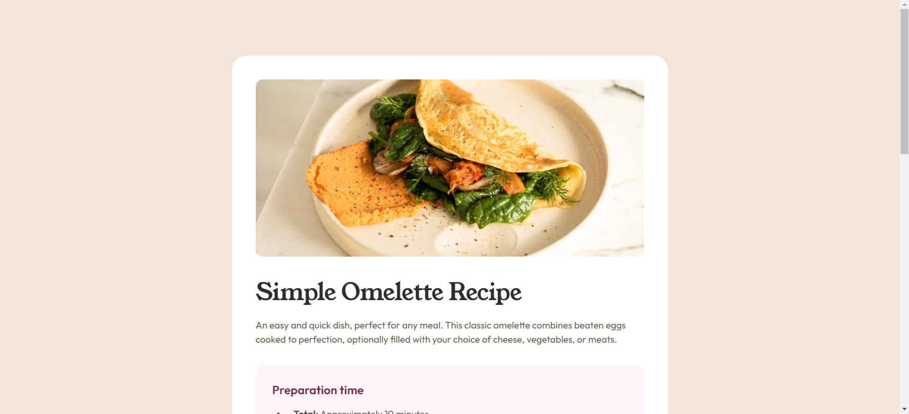
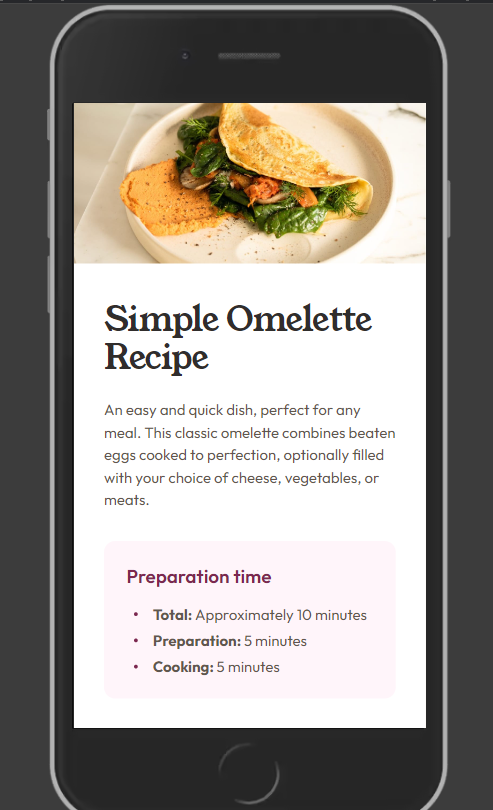

# Frontend Mentor - Recipe page solution

This is a solution to the [Recipe page challenge on Frontend Mentor](https://www.frontendmentor.io/challenges/recipe-page-KiTsR8QQKm). Frontend Mentor challenges help you improve your coding skills by building realistic projects.

## Table of contents

- [Overview](#overview)
  - [The challenge](#the-challenge)
  - [Screenshot](#screenshot)
  - [Links](#links)
- [My process](#my-process)
  - [Built with](#built-with)
- [Author](#author)

## Overview

### Screenshot

### Links

- Solution URL: [https://www.frontendmentor.io/solutions/recipe-page-UuQvQ6t4wZ](https://www.frontendmentor.io/solutions/recipe-page-UuQvQ6t4wZ)
- Live Site URL: [https://fm-recipe-page-kappa.vercel.app/](https://fm-recipe-page-kappa.vercel.app/)

## My process

### Built with

- Semantic HTML5 markup
- CSS custom properties
- Flexbox
- Mobile-first workflow
- [React](https://reactjs.org/) - JS library
- Tailwind CSSA

## Author

- Frontend Mentor - [@Loniewski02](https://www.frontendmentor.io/profile/Loniewski02)
